# [📈 Live Status](https://ks-collab.github.io/upptime): <!--live status--> **🟧 Partial outage**

This repository contains the open-source uptime monitor and status page for [Kaleidoglobe](https://www.kaleidoglobe.com), powered by [Upptime](https://github.com/upptime/upptime).

With [Upptime](https://upptime.js.org), you can get your own unlimited and free uptime monitor and status page, powered entirely by a GitHub repository. We use [Issues](https://github.com/ks-collab/upptime/issues) as incident reports, [Actions](https://github.com/ks-collab/upptime/actions) as uptime monitors, and [Pages](https://ks-collab.github.io/upptime) for the status page.

<!--start: status pages-->
<!-- This summary is generated by Upptime (https://github.com/upptime/upptime) -->
<!-- Do not edit this manually, your changes will be overwritten -->
<!-- prettier-ignore -->
| URL | Status | History | Response Time | Uptime |
| --- | ------ | ------- | ------------- | ------ |
|  [Petal Cite Production](https://cite.petal.org/api/status) | 🟥 Down | [petal-cite-production.yml](https://github.com/ks-collab/upptime/commits/HEAD/history/petal-cite-production.yml) | 

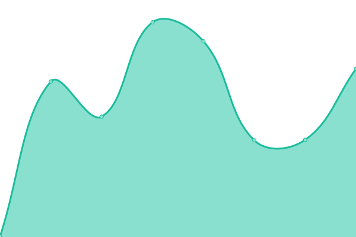 315ms
     
 | 

<a href="https://ks-collab.github.io/upptime/history/petal-cite-production">87.73%</a>
    

|  [Petal Cite Staging](https://cite.petal-dev.org/api/status) | 🟩 Up | [petal-cite-staging.yml](https://github.com/ks-collab/upptime/commits/HEAD/history/petal-cite-staging.yml) | 

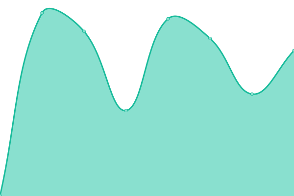 314ms
     
 | 

<a href="https://ks-collab.github.io/upptime/history/petal-cite-staging">99.93%</a>
    

|  [Petal Connect Production](https://connect.petal.org) | 🟩 Up | [petal-connect-production.yml](https://github.com/ks-collab/upptime/commits/HEAD/history/petal-connect-production.yml) | 

 265ms
     
 | 

<a href="https://ks-collab.github.io/upptime/history/petal-connect-production">100.00%</a>
    

|  [Petal Connect Staging](https://connect.petal-dev.org) | 🟩 Up | [petal-connect-staging.yml](https://github.com/ks-collab/upptime/commits/HEAD/history/petal-connect-staging.yml) | 

 258ms
     
 | 

<a href="https://ks-collab.github.io/upptime/history/petal-connect-staging">99.93%</a>
    

|  [Petal Website](https://www.petal.org) | 🟩 Up | [petal-website.yml](https://github.com/ks-collab/upptime/commits/HEAD/history/petal-website.yml) | 

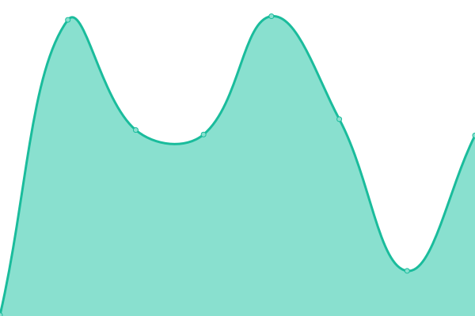 237ms
     
 | 

<a href="https://ks-collab.github.io/upptime/history/petal-website">100.00%</a>
    

|  [Grobid service](https://grobid.petal.org/api/isalive) | 🟩 Up | [grobid-service.yml](https://github.com/ks-collab/upptime/commits/HEAD/history/grobid-service.yml) | 

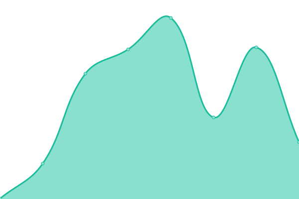 291ms
     
 | 

<a href="https://ks-collab.github.io/upptime/history/grobid-service">100.00%</a>
    

|  [Grafana service](https://grafana.petal.org) | 🟩 Up | [grafana-service.yml](https://github.com/ks-collab/upptime/commits/HEAD/history/grafana-service.yml) | 

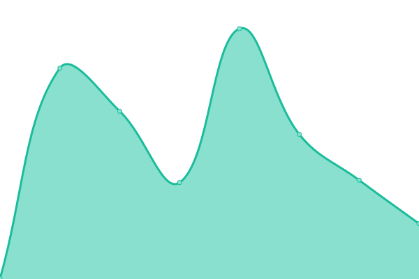 400ms
     
 | 

<a href="https://ks-collab.github.io/upptime/history/grafana-service">100.00%</a>
    

|  [CiteGen DOI Search Staging](https://cite.petal-dev.org/api/citegen/query) | 🟩 Up | [cite-gen-doi-search-staging.yml](https://github.com/ks-collab/upptime/commits/HEAD/history/cite-gen-doi-search-staging.yml) | 

 281ms
     
 | 

<a href="https://ks-collab.github.io/upptime/history/cite-gen-doi-search-staging">99.93%</a>
    

|  [CiteGen Article Search Staging](https://cite.petal-dev.org/api/citegen/query) | 🟩 Up | [cite-gen-article-search-staging.yml](https://github.com/ks-collab/upptime/commits/HEAD/history/cite-gen-article-search-staging.yml) | 

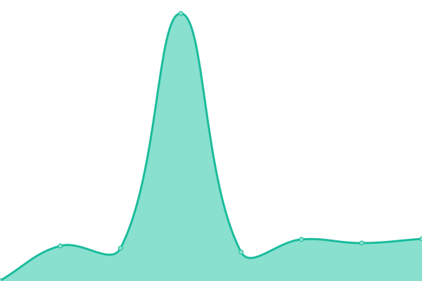 184ms
     
 | 

<a href="https://ks-collab.github.io/upptime/history/cite-gen-article-search-staging">99.93%</a>
    

|  [CiteGen Book Search Staging](https://cite.petal-dev.org/api/citegen/query) | 🟩 Up | [cite-gen-book-search-staging.yml](https://github.com/ks-collab/upptime/commits/HEAD/history/cite-gen-book-search-staging.yml) | 

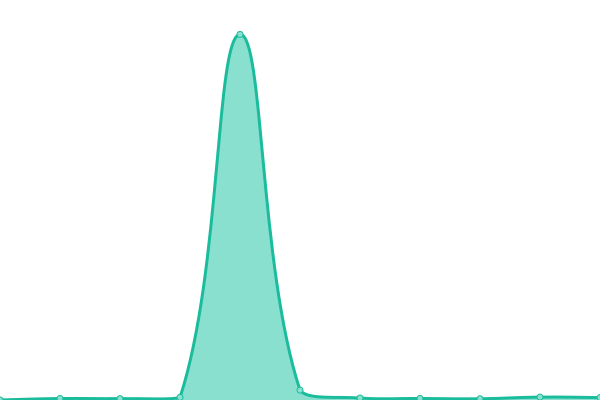 107ms
     
 | 

<a href="https://ks-collab.github.io/upptime/history/cite-gen-book-search-staging">99.93%</a>
    

|  [CiteGen Web Search Staging](https://cite.petal-dev.org/api/citegen/query) | 🟩 Up | [cite-gen-web-search-staging.yml](https://github.com/ks-collab/upptime/commits/HEAD/history/cite-gen-web-search-staging.yml) | 

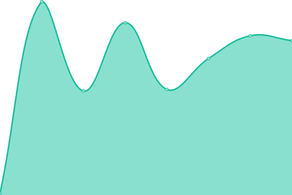 103ms
     
 | 

<a href="https://ks-collab.github.io/upptime/history/cite-gen-web-search-staging">99.93%</a>
    

|  [Translation Server](https://translation-server.petal.org/search) | 🟩 Up | [translation-server.yml](https://github.com/ks-collab/upptime/commits/HEAD/history/translation-server.yml) | 

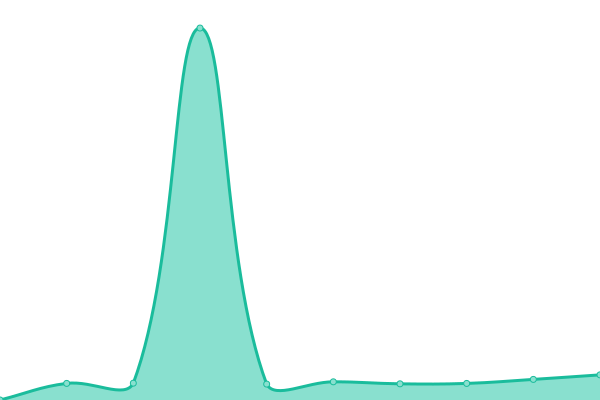 2901ms
     
 | 

<a href="https://ks-collab.github.io/upptime/history/translation-server">99.86%</a>
    

|  [OpenAI text-davinci-003](https://api.openai.com/v1/completions) | 🟩 Up | [open-ai-text-davinci-003.yml](https://github.com/ks-collab/upptime/commits/HEAD/history/open-ai-text-davinci-003.yml) | 

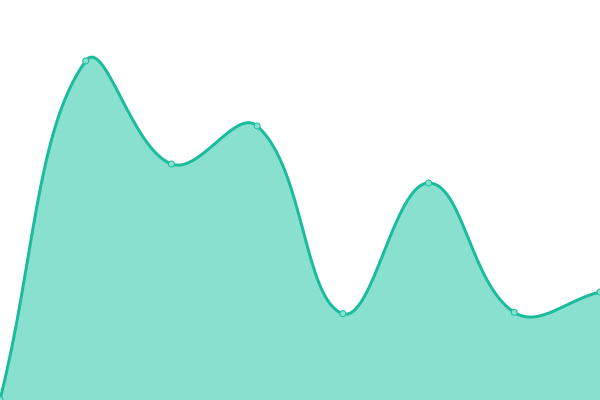 470ms
     
 | 

<a href="https://ks-collab.github.io/upptime/history/open-ai-text-davinci-003">99.44%</a>
    

|  [FDA 510(k) search](https://fda-search.petal.org/search) | 🟩 Up | [fda-510-k-search.yml](https://github.com/ks-collab/upptime/commits/HEAD/history/fda-510-k-search.yml) | 

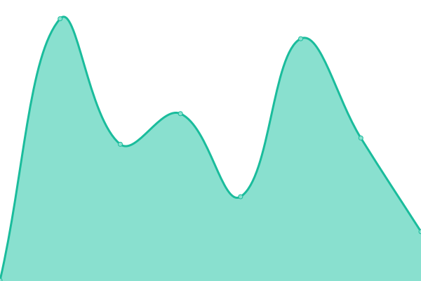 1719ms
     
 | 

<a href="https://ks-collab.github.io/upptime/history/fda-510-k-search">99.89%</a>
    

<!--end: status pages-->

[**Visit our status website →**](https://ks-collab.github.io/upptime)

## 📄 License

- Powered by: [Upptime](https://github.com/upptime/upptime)
- Code: [MIT](./LICENSE) © [Kaleidoglobe](https://www.kaleidoglobe.com)
- Data in the `./history` directory: [Open Database License](https://opendatacommons.org/licenses/odbl/1-0/)
