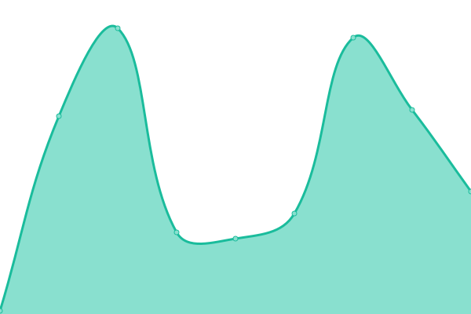
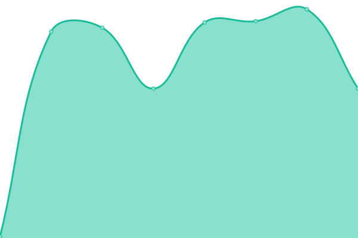

# [📈 Live Status](https://ks-collab.github.io/upptime): <!--live status--> **🟩 All systems operational**

This repository contains the open-source uptime monitor and status page for [Kaleidoglobe](https://www.kaleidoglobe.com), powered by [Upptime](https://github.com/upptime/upptime).

With [Upptime](https://upptime.js.org), you can get your own unlimited and free uptime monitor and status page, powered entirely by a GitHub repository. We use [Issues](https://github.com/ks-collab/upptime/issues) as incident reports, [Actions](https://github.com/ks-collab/upptime/actions) as uptime monitors, and [Pages](https://ks-collab.github.io/upptime) for the status page.

<!--start: status pages-->
<!-- This summary is generated by Upptime (https://github.com/upptime/upptime) -->
<!-- Do not edit this manually, your changes will be overwritten -->
<!-- prettier-ignore -->
| URL | Status | History | Response Time | Uptime |
| --- | ------ | ------- | ------------- | ------ |
|  [Petal Cite Production](https://cite.petal.org/api/status) | 🟩 Up | [petal-cite-production.yml](https://github.com/ks-collab/upptime/commits/HEAD/history/petal-cite-production.yml) | 

 382ms
     
 | 

<a href="https://ks-collab.github.io/upptime/history/petal-cite-production">84.63%</a>
    

|  [Petal Cite Staging](https://cite.petal-dev.org/api/status) | 🟩 Up | [petal-cite-staging.yml](https://github.com/ks-collab/upptime/commits/HEAD/history/petal-cite-staging.yml) | 

 379ms
     
 | 

<a href="https://ks-collab.github.io/upptime/history/petal-cite-staging">100.00%</a>
    

|  [Petal Connect Production](https://connect.petal.org) | 🟩 Up | [petal-connect-production.yml](https://github.com/ks-collab/upptime/commits/HEAD/history/petal-connect-production.yml) | 

 339ms
     
 | 

<a href="https://ks-collab.github.io/upptime/history/petal-connect-production">84.63%</a>
    

|  [Petal Connect Staging](https://connect.petal-dev.org) | 🟩 Up | [petal-connect-staging.yml](https://github.com/ks-collab/upptime/commits/HEAD/history/petal-connect-staging.yml) | 

 364ms
     
 | 

<a href="https://ks-collab.github.io/upptime/history/petal-connect-staging">100.00%</a>
    

|  [Petal Website](https://www.petal.org) | 🟩 Up | [petal-website.yml](https://github.com/ks-collab/upptime/commits/HEAD/history/petal-website.yml) | 

 288ms
     
 | 

<a href="https://ks-collab.github.io/upptime/history/petal-website">100.00%</a>
    

|  [Grobid service](https://grobid.petal.org/api/isalive) | 🟩 Up | [grobid-service.yml](https://github.com/ks-collab/upptime/commits/HEAD/history/grobid-service.yml) | 

 280ms
     
 | 

<a href="https://ks-collab.github.io/upptime/history/grobid-service">100.00%</a>
    

|  [Grafana service](https://grafana.petal.org) | 🟩 Up | [grafana-service.yml](https://github.com/ks-collab/upptime/commits/HEAD/history/grafana-service.yml) | 

 469ms
     
 | 

<a href="https://ks-collab.github.io/upptime/history/grafana-service">100.00%</a>
    

|  [CiteGen DOI Search Staging](https://cite.petal-dev.org/api/citegen/query) | 🟩 Up | [cite-gen-doi-search-staging.yml](https://github.com/ks-collab/upptime/commits/HEAD/history/cite-gen-doi-search-staging.yml) | 

 257ms
     
 | 

<a href="https://ks-collab.github.io/upptime/history/cite-gen-doi-search-staging">100.00%</a>
    

|  [CiteGen Article Search Staging](https://cite.petal-dev.org/api/citegen/query) | 🟩 Up | [cite-gen-article-search-staging.yml](https://github.com/ks-collab/upptime/commits/HEAD/history/cite-gen-article-search-staging.yml) | 

 104ms
     
 | 

<a href="https://ks-collab.github.io/upptime/history/cite-gen-article-search-staging">100.00%</a>
    

|  [CiteGen Book Search Staging](https://cite.petal-dev.org/api/citegen/query) | 🟩 Up | [cite-gen-book-search-staging.yml](https://github.com/ks-collab/upptime/commits/HEAD/history/cite-gen-book-search-staging.yml) | 

 108ms
     
 | 

<a href="https://ks-collab.github.io/upptime/history/cite-gen-book-search-staging">100.00%</a>
    

|  [CiteGen Web Search Staging](https://cite.petal-dev.org/api/citegen/query) | 🟩 Up | [cite-gen-web-search-staging.yml](https://github.com/ks-collab/upptime/commits/HEAD/history/cite-gen-web-search-staging.yml) | 

 107ms
     
 | 

<a href="https://ks-collab.github.io/upptime/history/cite-gen-web-search-staging">100.00%</a>
    

|  [Translation Server](https://translation-server.petal.org/search) | 🟩 Up | [translation-server.yml](https://github.com/ks-collab/upptime/commits/HEAD/history/translation-server.yml) | 

 817ms
     
 | 

<a href="https://ks-collab.github.io/upptime/history/translation-server">100.00%</a>
    

|  [OpenAI gpt-3.5-turbo](https://api.openai.com/v1/chat/completions) | 🟩 Up | [open-ai-gpt-3-5-turbo.yml](https://github.com/ks-collab/upptime/commits/HEAD/history/open-ai-gpt-3-5-turbo.yml) | 

 430ms
     
 | 

<a href="https://ks-collab.github.io/upptime/history/open-ai-gpt-3-5-turbo">100.00%</a>
    

|  [OpenAI gpt-4](https://api.openai.com/v1/chat/completions) | 🟩 Up | [open-ai-gpt-4.yml](https://github.com/ks-collab/upptime/commits/HEAD/history/open-ai-gpt-4.yml) | 

 644ms
     
 | 

<a href="https://ks-collab.github.io/upptime/history/open-ai-gpt-4">100.00%</a>
    

|  [gpt-trainer.com](https://gpt-trainer.com) | 🟩 Up | [gpt-trainer-com.yml](https://github.com/ks-collab/upptime/commits/HEAD/history/gpt-trainer-com.yml) | 

 129ms
     
 | 

<a href="https://ks-collab.github.io/upptime/history/gpt-trainer-com">100.00%</a>
    

|  [app.gpt-trainer.com/api/status](https://app.gpt-trainer.com/api/status) | 🟩 Up | [app-gpt-trainer-com-api-status.yml](https://github.com/ks-collab/upptime/commits/HEAD/history/app-gpt-trainer-com-api-status.yml) | 

 279ms
     
 | 

<a href="https://ks-collab.github.io/upptime/history/app-gpt-trainer-com-api-status">100.00%</a>
    

|  [voice.gpt-trainer.com](https://app.gpt-trainer.com/api/status) | 🟩 Up | [voice-gpt-trainer-com.yml](https://github.com/ks-collab/upptime/commits/HEAD/history/voice-gpt-trainer-com.yml) | 

 67ms
     
 | 

<a href="https://ks-collab.github.io/upptime/history/voice-gpt-trainer-com">100.00%</a>
    

|  [clinical trials search](http://52.39.84.167/ping) | 🟩 Up | [clinical-trials-search.yml](https://github.com/ks-collab/upptime/commits/HEAD/history/clinical-trials-search.yml) | 

 123ms
     
 | 

<a href="https://ks-collab.github.io/upptime/history/clinical-trials-search">100.00%</a>
    

<!--end: status pages-->

[**Visit our status website →**](https://ks-collab.github.io/upptime)

## 📄 License

- Powered by: [Upptime](https://github.com/upptime/upptime)
- Code: [MIT](./LICENSE) © [Kaleidoglobe](https://www.kaleidoglobe.com)
- Data in the `./history` directory: [Open Database License](https://opendatacommons.org/licenses/odbl/1-0/)
